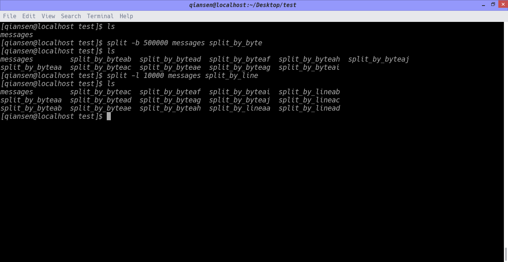

### log_cutting
1. 以文件大小进行切割：
```
split -b 500000 messages split_by_byte
```
默认以byte为单位，可以指定切割单位，split_by_byte是切割生成的文件的前缀
2. 以文件行数进行切割：
```
split -l 10000 messages split_by_line
```
split_by_line是切割生成的文件的前缀

执行结果：


这种单纯的分割文件不利于日志分析呀